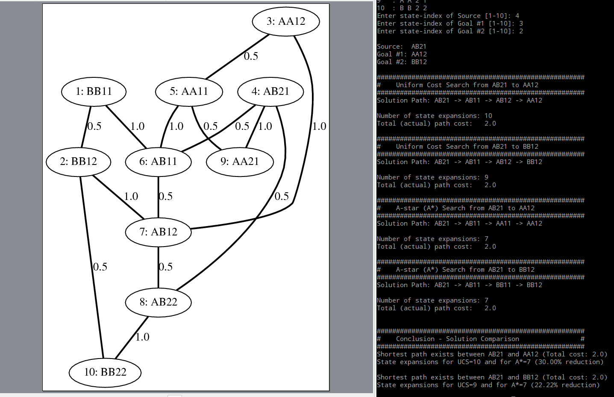

# ai-course-uoi

## About
This repository contains the code developed during the Artificial Intelligence course @[cse.uoi.gr](http://cse.uoi.gr).

The first exercise is about the implementation of the [minimax algorithm](https://en.wikipedia.org/wiki/Minimax) 
and it's usage for deciding computer player moves during a custom game with a human player as an oponent.

The second exercise is about implementing the [A* (A star)](https://en.wikipedia.org/wiki/A*_search_algorithm) and
[UCS (Uniform Cost Search)](https://en.wikipedia.org/wiki/Uniform-cost_search) algorithms and using them to
find the shortest path between an initial and two goal states. Note that the state space is randomly created every time.

## Additional Features
In the second exercise, [DOT graph description language](https://en.wikipedia.org/wiki/DOT_(graph_description_language)) was used to visualize the generated state space and the available transitions between states. Although game tree graphing was also implemented for the first exercise, it was later removed due to the large size of the graph (for a branch factor of 6 and a tree depth of 4, 1296 nodes need to be plotted).

_Screenshot #1_:

_Screenshot #2_:

## Developer
[George Z. Zachos](https://gzachos.com)

## License
[GNU GENERAL PUBLIC LICENSE Version 2, June 1991](LICENSE)
